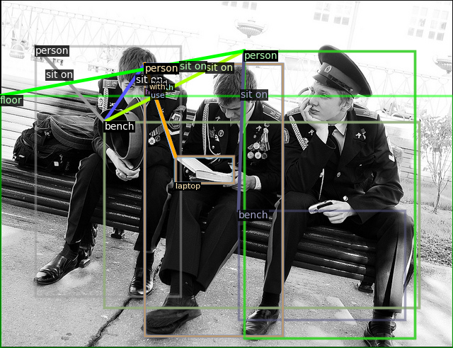

# Visual Relation of Interest Detection
## Environment
#### main dependencies
- python 3.8
- cuda 11.1
- cudnn 8.0
- pytorch 1.7 
```
apt-get install libglib2.0-dev libsm6 libxrender-dev libxext6  
pip install torch==1.7.1+cu110 torchvision==0.8.2+cu110 -f https://download.pytorch.org/whl/torch_stable.html  
```

#### other dependencies
- cython==0.29.21
- matplotlib==3.2.2
- Shapely==1.7.1
- termcolor==1.1.0
- yacs==0.1.8
- opencv_python==3.4.8.29
- cloudpickle==1.5.0
- numpy==1.20.0
- pycocotools==2.0.2
- iopath==0.1.7
- tabulate==0.8.7
- scipy==1.5.0
- Pillow==8.1.0
- setuptools==41.0.0
- tensorboard==2.4.1
- pyyaml==5.4.1

You can just run the script:
```
pip install -r requirements.txt
```  
If you encounter an error when update the pyyaml, try to: 
```
pip install pyyaml==5.4.1 --ignore-installed
``` 

#### directly use the docker
If your GPU support CUDA11.1, you can directly use the docker image that we provide.
```
docker pull yfraquelle/vroid_env:v1  
docker run -it -v /host/path/to/VROID:/docker/path/to/VROID --ipc=host --net=host <image_id> /bin/bash  
```

#### custom environment
If you need a custom environment, make sure to use pytorch1.7 and the other dependencies should be adapted to pytorch1.7.  
An example: python 3.6+, cuda 10.2, cudnn 7.6, pytorch 1.7
```
pip install torch==1.7.1 torchvision==0.8.2
pip install -r requirements.txt
```
For reference: https://pytorch.org/get-started/previous-versions/  


## Dataset
We constructed a ViROI dataset for VROID based on the 45,000 images in the IOID dataset and their corresponding captions in the MSCOCO dataset. After filtering the images without VROIs, the ViROI dataset contains 30,120 images. It is further divided into the training set (25,091 images with 91,496 VROIs) and the test set (5,029 images with 18,268 VROIs).  
Download data to  
../data  
├── [viroi_json](https://drive.google.com/file/d/1PwntYlHar803vArwLV9Ba2KaRl9BT7ee/view?usp=sharing)  
│   ├── train_images_dict.json  
│   ├── train_images_triplets_dict.json  
│   ├── test_images_dict.json  
│   ├── test_images_triplets_dict.json  
│   ├── class_dict.json  
│   └── relation_dict.json  
├── [ioid_images](https://drive.google.com/file/d/1yRyduTD58_lL1GI4oGoUdhpi3gnjzvgO/view?usp=sharing) (MSCOCO images filtered by IOID)  
└── [ioid_panoptic](https://drive.google.com/file/d/1nxvSLhNkk7Vc2HEEXquG51tESwEHK07T/view?usp=sharing) (MSCOCO panoptic annotation images filtered by IOID)    


## Preprocess
#### installation
```
python setup.py build develop
```

#### data preparation  
Download the [glove.6B](https://nlp.stanford.edu/data/wordvecs/glove.6B.zip) and unzip the the whole folder to the root.
```
python prepare_panoptic.py
python init_predicate_matrix.py
```


## Demo
The [pretrained model](https://drive.google.com/file/d/1-QOTkAUbfFzilNWHoXL6BOonOMtmxjML/view?usp=sharing) needs to be downloaded to the root.  
```
python main.py --config configs/VROID/demo.yaml --mode demo --image_path 000000000328.jpg --visible --visible_num 10
```
The top 10 relations of interest will be visualized in "000000000328_10.png".



## Train
Download the [initialization model for training](https://dl.fbaipublicfiles.com/detectron2/COCO-PanopticSegmentation/panoptic_fpn_R_101_3x/139514519/model_final_cafdb1.pkl) to the root.
```
python main.py --config configs/VROID/our.yaml --mode train_relation    
```


## Test
```  
python main.py --config configs/VROID/test_our.yaml --mode test_relation
```
If you did not train the model for yourself, download the pretrained model, rename it as "model_final.pth" and move it to the "output/our/" folder.  

#### evaluation
```
python evaluate.py --pred_json output/test_our.yaml.json  --top_n 0  
python evaluate.py --pred_json output/test_our.yaml.json  --top_n 10  
python evaluate.py --pred_json output/test_our.yaml.json  --top_n 20  
python evaluate.py --pred_json output/test_our.yaml.json  --top_n 50  
python evaluate.py --pred_json output/test_our.yaml.json  --top_n 100  
```


## Component analysis
```
./component_analysis_train.sh  
./component_analysis_test.sh
```  
The [pretrained model for component analysis](https://1drv.ms/u/s!AqIJSYD5gt-YjV1jEVu0nMn3b0Ym?e=jfic91) can be downloaded.  


## Comparison with other methods
Download [coco category](https://github.com/cocodataset/panopticapi/blob/master/panoptic_coco_categories.json), move it to "../data" and generate the detection results:
```  
python main.py --config configs/VROID/Base-Panoptic-FPN.yaml --mode test_panoptic  
```

methods for comparison:  
- [STA](https://github.com/yangxuntu/vtranse.git)
- [MFULRN](https://github.com/pranoyr/visual-relationship-detection.git)
- [IMP](https://github.com/danfeiX/scene-graph-TF-release.git)
- [Graph R-CNN](https://github.com/jwyang/graph-rcnn.pytorch)
- [neural motifs](https://github.com/rowanz/neural-motifs.git)
- [VCTree](https://github.com/KaihuaTang/Scene-Graph-Benchmark.pytorch.git)
- [DSS](https://github.com/Andrew-Qibin/DSS.git)
- [NLDF](https://github.com/zhimingluo/NLDF.git)
- [ARNet](https://github.com/chenxinpeng/ARNet.git)
- [MMT](https://github.com/aimagelab/meshed-memory-transformer.git)
- [DSG](https://github.com/shikorab/DSG.git)
- Stanford CoreNLP
- Frequency: ./frequency.sh
